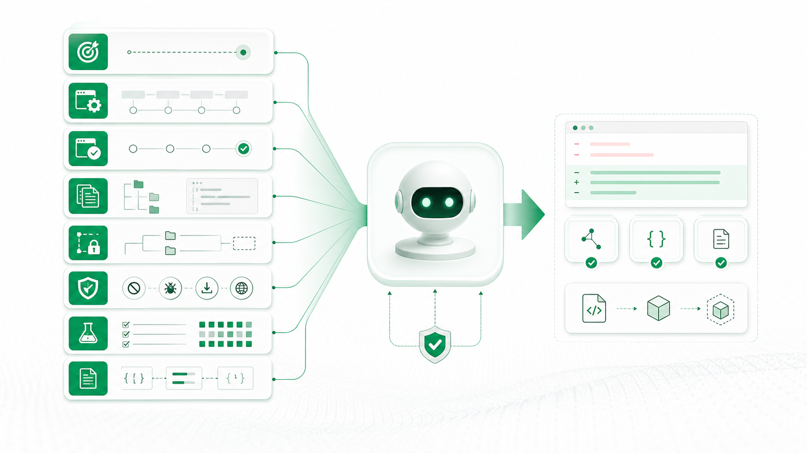

# Module 03: Context Engineering - giao việc cho AI như một lực lượng thực thi

**Bài này giúp người học đưa đúng ngữ cảnh để AI Agent không đoán sai, sửa quá rộng hoặc bỏ qua ràng buộc quan trọng.**


*Chú thích: Prompt tốt không chỉ là câu lệnh; nó là bối cảnh đủ để AI hiểu hệ thống trước khi hành động.*

## 0. Vấn đề thật

Một yêu cầu “sửa bug này” thường thiếu file liên quan, kiến trúc hiện tại, convention, test cần chạy, phạm vi được sửa và điều cấm. AI vẫn có thể làm, nhưng phải đoán.

**Một câu cần nhớ:** Context Engineering là thiết kế môi trường ra quyết định cho AI.

## 1. Bóc tách bản chất

| Thành phần context | Vì sao cần | Ví dụ |
|---|---|---|
| Mục tiêu | Giữ AI bám outcome. | Không báo thành công khi device offline. |
| Kiến trúc hiện tại | Tránh phá boundary. | State update nằm ở module sync. |
| File liên quan | Giảm tìm lan man. | `device-service`, `state-store`, tests. |
| Convention | Giữ maintainability. | Không thêm dependency mới. |
| Test bắt buộc | Chứng minh đúng. | Offline, timeout, duplicated device. |
| Điều không được đổi | Giữ compatibility. | Không đổi public API. |


*Chú thích: Context tốt chuyển AI từ trạng thái suy đoán sang trạng thái thực thi trong đường ray rõ.*

## 2. Nguyên lý cốt lõi

| Nguyên lý | Giải thích | Khi nào dễ sai |
|---|---|---|
| Context trước solution | Đừng yêu cầu giải pháp khi chưa cho đủ bối cảnh. | Copy prompt chung cho mọi repo. |
| Scope là guardrail | Phạm vi sửa càng rõ, rủi ro lan càng thấp. | Cho AI “dọn code” trong task bug nhỏ. |
| Output format giúp review | Yêu cầu AI tóm tắt nguyên nhân, file sửa, test, rủi ro. | Nhận diff mà không biết lý do. |

## 3. Mô hình tư duy

```text
Task Brief = Goal + Current Behavior + Expected Behavior + Relevant Context + Allowed Scope + Constraints + Tests + Output Contract
```

## 4. Quy trình hành động

| Bước | Việc cần làm | Đầu ra |
|---|---|---|
| 1 | Nêu bug/hành vi hiện tại và mong muốn. | AI hiểu vấn đề thật. |
| 2 | Chỉ định module/file cần xem trước. | Tìm đúng nơi. |
| 3 | Ghi phạm vi được sửa/không được sửa. | Giảm blast radius. |
| 4 | Yêu cầu test và summary. | Dễ review. |


*Chú thích: Một task brief tốt giúp AI tạo diff nhỏ hơn, dễ kiểm chứng hơn và ít phá hệ thống hơn.*

## 5. Case thực chiến

Bug: thiết bị offline nhưng app vẫn báo “đã bật”. Nếu prompt chỉ nói “fix offline bug”, AI có thể sửa UI text. Prompt tốt phải nói nguồn thật của trạng thái là backend/device response, không đổi API, thêm test offline/timeout và log từ command tới confirmed state.

## 6. Thực hành

Viết prompt giao AI cho bug trên. Chấm theo rubric: có goal, context, scope, constraint, tests, output contract.

## 7. Công cụ mang về

Template giao việc cho AI Agent trong `cong-cu-thuc-hanh-ai-agent.md`.

