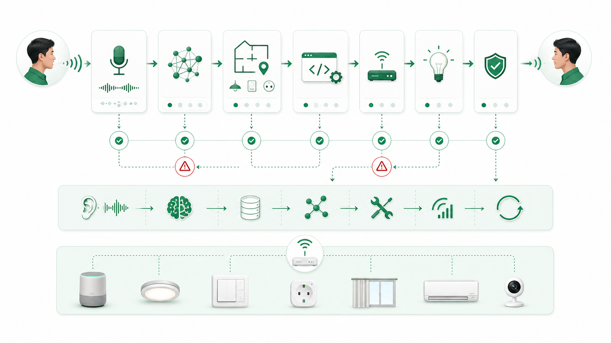

# Module 04: Architecture - chia hệ thống đúng để AI không nhân bản sự rối

**Bài này giúp người học nhìn toàn chuỗi hệ thống thay vì chỉ nhìn một function hoặc một PR.**


*Chú thích: Một câu lệnh người dùng đơn giản thường đi qua nhiều tầng kỹ thuật và nhiều điểm lỗi.*

## 0. Vấn đề thật

AI có thể viết một hàm tốt, nhưng sản phẩm không được tạo ra từ một hàm tốt. Nếu module, interface, state, error flow và ownership mơ hồ, AI sẽ sửa nhanh trong một cấu trúc sai.

**Một câu cần nhớ:** AI giỏi làm từng mảnh; con người phải chia đúng mảnh.

## 1. Bóc tách bản chất

| Thành phần kiến trúc | Câu hỏi | Rủi ro nếu mơ hồ |
|---|---|---|
| Module | Trách nhiệm nằm ở đâu? | Logic lặp và coupling. |
| Interface | Tầng này hứa trả gì? | Contract vỡ khi sửa. |
| State | Trạng thái thật ở đâu? | UI tin trạng thái giả. |
| Error flow | Lỗi đi qua đâu? | Báo thành công sai. |
| Ownership | Ai review phần này? | Không ai chịu trách nhiệm cuối. |


*Chú thích: Kiến trúc đúng làm rõ dữ liệu, trạng thái và lỗi di chuyển qua hệ thống như thế nào.*

## 2. Nguyên lý cốt lõi

| Nguyên lý | Giải thích | Dễ sai khi |
|---|---|---|
| Boundary bảo vệ tốc độ | Ranh giới rõ giúp AI sửa nhanh mà ít lan. | Cho AI sửa xuyên nhiều tầng. |
| State phải có nguồn thật | Lệnh đã gửi không đồng nghĩa thiết bị đã đổi trạng thái. | UI dùng optimistic state như confirmed state. |
| Error flow là kiến trúc | Lỗi không phải phần phụ. | Chỉ thiết kế happy path. |

## 3. Mô hình tư duy

```text
Audio → Speech Recognition → Intent → Device/Room Mapping → Tool Call → Device Response → Confirmed State → User Response
```

## 4. Quy trình hành động

| Bước | Việc cần làm | Đầu ra |
|---|---|---|
| 1 | Vẽ dòng dữ liệu chính. | Biết input/output từng tầng. |
| 2 | Vẽ dòng lỗi. | Biết lỗi bị bắt ở đâu. |
| 3 | Gắn ownership. | Biết ai review. |
| 4 | Chỉ định test theo boundary. | Không test quá hẹp. |


*Chú thích: Trước khi giao AI viết code, team cần biết thay đổi nằm ở tầng nào và không được vượt qua boundary nào.*

## 5. Case thực chiến

“Bật đèn phòng khách” có thể thất bại ở nhận diện giọng nói, hiểu intent, map sai phòng, chọn sai thiết bị, thiết bị offline, gateway timeout hoặc thiếu confirmed state. Nếu chỉ sửa function gọi API, team có thể bỏ sót lỗi ở mapping hoặc response.

## 6. Thực hành

Vẽ flow cho một tính năng đang làm. Đánh dấu: source of truth, error point, retry, log, owner, test. Nếu không đánh dấu được, chưa nên giao AI sửa code rộng.

## 7. Công cụ mang về

Bảng Architecture Boundary Review: module, responsibility, input, output, state, error, owner, test.

