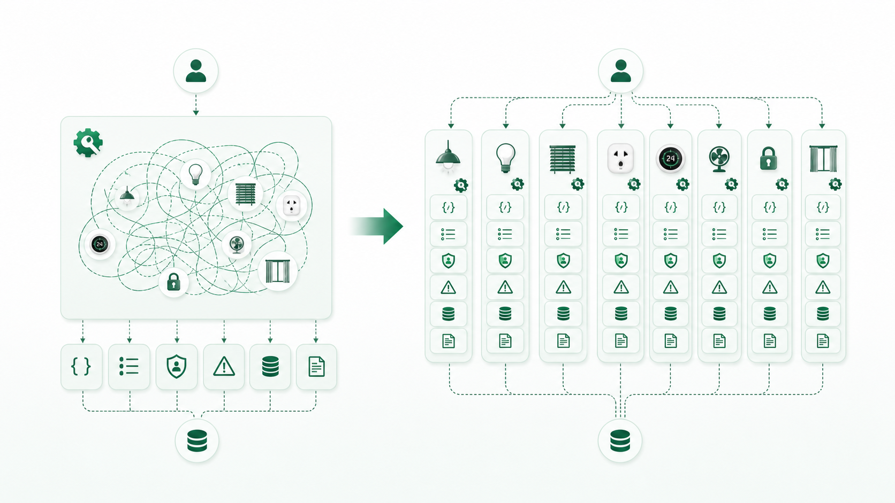

# Module 05: Tool/API Design - thiết kế “tay chân” an toàn cho AI Agent

**Bài này giúp người học thiết kế API/tool rõ intent, ít nhập nhằng và có guardrail cho hành động rủi ro.**


*Chú thích: Trong hệ thống AI-native, API không chỉ dành cho con người; nó là cách AI hành động trong thế giới thật.*

## 0. Vấn đề thật

Tool mơ hồ như `control_device(name, value)` dễ khiến AI chọn sai thiết bị, sai hành động hoặc báo thành công khi chưa có xác nhận. Tool rõ giúp AI hành động đúng hơn và reviewer dễ kiểm chứng hơn.

**Một câu cần nhớ:** Tool càng mơ hồ, AI càng dễ dùng sai; tool càng rõ, hệ thống càng dễ kiểm chứng.

## 1. Bóc tách bản chất

| Thiết kế | Vấn đề | Phiên bản rõ hơn |
|---|---|---|
| `control_device(name, value)` | `name` nhập nhằng, `value` không có kiểu. | `set_device_power(device_id, power_state)` |
| `set_light(value)` | Không biết brightness hay power. | `set_light_brightness(device_id, brightness_percent)` |
| `send_command(payload)` | Không có contract rõ. | Tool theo intent với enum và response schema. |


*Chú thích: API tốt giảm không gian diễn giải sai bằng tên, kiểu, enum, permission và response rõ.*

## 2. Nguyên lý cốt lõi

| Nguyên lý | Giải thích | Dễ sai khi |
|---|---|---|
| Một tool nên có một intent chính | Giảm hành vi bất ngờ. | Gom nhiều hành động vào một endpoint tiện lợi. |
| Kiểu dữ liệu là guardrail | Enum và schema giúp AI ít gọi sai. | Dùng string tự do. |
| Response phải phân biệt sent và confirmed | Gửi lệnh thành công chưa chắc thiết bị đổi trạng thái. | Trả `success=true` quá sớm. |
| Hành động rủi ro cần permission | Một số tool cần approval hoặc scope. | Cho AI thao tác production tự do. |

## 3. Mô hình tư duy

```text
Tool tốt = Tên rõ + Input rõ + Enum rõ + Permission rõ + Error rõ + Response rõ + Log rõ
```

## 4. Quy trình hành động

| Bước | Việc cần làm | Đầu ra |
|---|---|---|
| 1 | Tách tool theo intent. | API ít nhập nhằng. |
| 2 | Chuyển string tự do thành enum/schema. | Guardrail dữ liệu. |
| 3 | Thiết kế error và confirmed state. | Không báo thành công giả. |
| 4 | Gắn permission và audit log. | An toàn vận hành. |


*Chú thích: Thiết kế tool tốt bắt đầu từ hành động thật, rủi ro thật và bằng chứng phản hồi thật.*

## 5. Case thực chiến

AI nhận “mở rèm phòng ngủ” nhưng tool chỉ có `control_device(name, value)`. Nếu có nhiều rèm hoặc một scene cùng tên, AI có thể chọn sai. Tool tốt cần device id, loại hành động, trạng thái mong muốn, permission và phản hồi xác nhận.

## 6. Thực hành

Chọn một API hoặc tool hiện có. Viết lại theo 7 tiêu chí: tên rõ, input rõ, enum, permission, error, response, log.

## 7. Công cụ mang về

Checklist Tool/API Design: intent, schema, enum, id thay vì tên, permission, idempotency, confirmed state, audit log.

