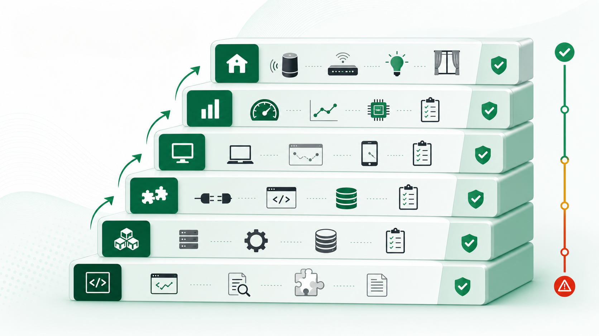

# Module 06: Evaluation - bằng chứng nào cho thấy kết quả đúng?

**Bài này giúp người học chuyển từ “nhìn ổn” sang kiểm chứng bằng test, log, benchmark và bằng chứng thiết bị thật.**


*Chú thích: Sau khi AI tạo kết quả, câu hỏi đầu tiên phải là “bằng chứng đâu?”.*

## 0. Vấn đề thật

AI có thể tạo PR sạch, đặt tên tốt và viết test có vẻ hợp lý. Nhưng PR vẫn có thể sai yêu cầu, phá kiến trúc, bỏ sót edge case hoặc yếu trên thiết bị thật.

**Một câu cần nhớ:** Không có kiểm chứng, AI chỉ tạo ra cảm giác tiến bộ.

## 1. Bóc tách bản chất

| Loại bằng chứng | Dùng khi | Ví dụ |
|---|---|---|
| Unit test | Logic cục bộ. | Validate input, state transition. |
| Integration test | Nhiều module phối hợp. | API tới state store. |
| Contract test | Interface cần giữ ổn định. | Response schema không đổi. |
| E2E test | Luồng người dùng. | Bật đèn theo phòng. |
| Load/security test | Rủi ro hiệu năng/bảo mật. | Latency, permission bypass. |
| HIL/fault injection | Firmware/thiết bị thật. | Timeout, brown-out, packet loss. |


*Chú thích: Mỗi loại rủi ro cần một loại bằng chứng phù hợp; unit test không thay thế được thiết bị thật.*

## 2. Nguyên lý cốt lõi

| Nguyên lý | Giải thích | Dễ sai khi |
|---|---|---|
| Test phải gắn với rủi ro | Không phải mọi test đều có giá trị như nhau. | Test happy path để che lỗi error path. |
| Log là bằng chứng vận hành | Khi lỗi thật xảy ra, log giúp truy vết. | Chỉ log “failed”. |
| Firmware cần thực tế vật lý | Mock không đo timing, power, watchdog, nhiễu. | Tin driver mẫu vì compile được. |

## 3. Mô hình tư duy

```text
Risk → Evidence Type → Test/Log/Metric → Pass Criteria → Residual Risk
```

## 4. Quy trình hành động

| Bước | Việc cần làm | Đầu ra |
|---|---|---|
| 1 | Nêu rủi ro chính của thay đổi. | Danh sách rủi ro. |
| 2 | Chọn loại bằng chứng tương ứng. | Test/log/metric. |
| 3 | Đặt ngưỡng pass. | Tiêu chí khách quan. |
| 4 | Ghi rủi ro còn lại. | Quyết định release có trách nhiệm. |


*Chú thích: Evaluation tốt biến review từ cảm giác thành đối chiếu rủi ro với bằng chứng.*

## 5. Case thực chiến

AI sinh state machine firmware cho relay. Compile pass chưa đủ. Cần test timing, memory, watchdog recovery, mất gói truyền thông, reboot giữa lệnh, long-run và xác nhận trên thiết bị thật.

## 6. Thực hành

Với một PR hiện tại, lập bảng Risk → Evidence. Nếu có rủi ro cao mà không có bằng chứng, PR chưa sẵn sàng merge.

## 7. Công cụ mang về

Rubric review code do AI sinh trong `cong-cu-thuc-hanh-ai-agent.md`.

