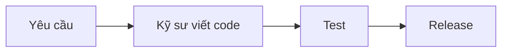
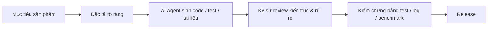
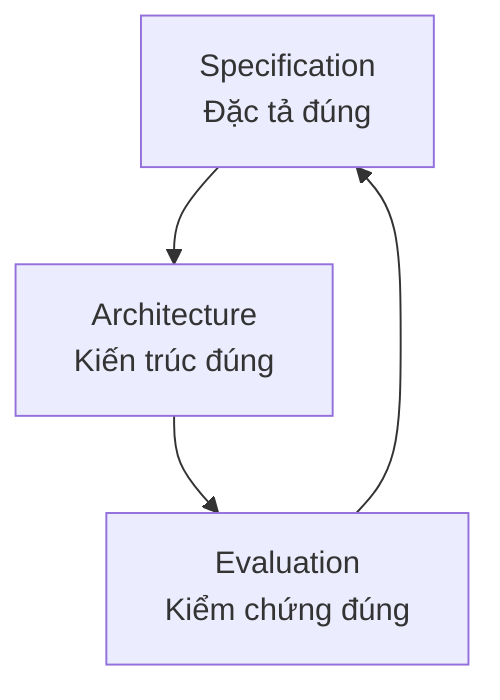
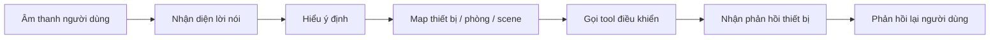
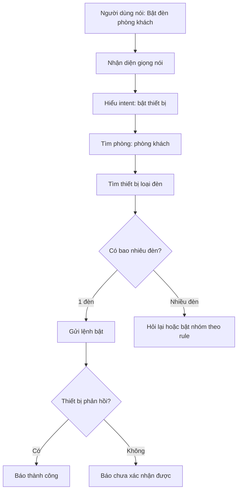

# Khi AI Agent biết code, kỹ sư R&D cần giỏi điều gì hơn?

> **Một bài chia sẻ kỹ thuật dành cho toàn bộ nhân sự phòng R&D**  
> Dành cho Software Engineer, Firmware Engineer, Tester, BA, PM, Leader và tất cả những ai đang cùng xây sản phẩm công nghệ trong thời đại AI Native Agent.

---

## 1. Mở đầu: Một câu hỏi hơi “đau”, nhưng rất cần hỏi

Hãy tưởng tượng một ngày rất gần.

Bạn đưa cho AI Agent một yêu cầu:

> “Tạo giúp tôi một API điều khiển thiết bị, có validate dữ liệu, có log, có test, có tài liệu.”

Vài phút sau, AI tạo ra:

- Code.
- Unit test.
- Tài liệu API.
- Migration database.
- Một pull request khá sạch.
- Thậm chí còn tự sửa lỗi sau khi chạy test fail.

Nghe rất hấp dẫn.

Nhưng cũng có một câu hỏi lớn:

> **Nếu AI đã có thể viết code nhanh như vậy, vậy giá trị thật sự của kỹ sư còn nằm ở đâu?**

Câu trả lời không phải là: “Chúng ta phải code nhanh hơn AI.”

Câu trả lời đúng hơn là:

> **Chúng ta phải trở thành người biết định nghĩa đúng bài toán, thiết kế đúng hệ thống, kiểm chứng đúng kết quả, và dùng AI Agent như một lực lượng thực thi cực mạnh.**

Trong thời đại AI Agent, kỹ sư không mất giá trị. Nhưng **loại giá trị cần tạo ra sẽ thay đổi rất mạnh**.

---

## 2. Thông điệp chính trong một câu

> **Thời AI Native Agent, kỹ sư giỏi không chỉ là người viết code tốt, mà là người biến vấn đề mơ hồ thành hệ thống rõ ràng, có kiến trúc, có tiêu chuẩn kiểm chứng, và có thể giao cho AI cùng con người thực thi an toàn.**

Nói ngắn hơn:

> **Từ coder → người thiết kế hệ thống thực thi.**

Hoặc dễ nhớ hơn:

> **AI có thể viết code rất nhanh. Nhưng con người phải biết code đó có đúng vấn đề, đúng kiến trúc, đúng ràng buộc và đúng thực tế hay không.**

---

## 3. AI Agent là gì? Đừng hiểu nó chỉ là ChatGPT biết trả lời

Trước đây, nhiều người dùng AI như một công cụ hỏi đáp:

> “Viết giúp tôi hàm này.”  
> “Giải thích giúp tôi đoạn code này.”  
> “Tạo giúp tôi unit test.”

Nhưng AI Agent đi xa hơn.

AI Agent có thể:

- Hiểu mục tiêu.
- Lập kế hoạch.
- Đọc file trong project.
- Gọi tool.
- Chạy lệnh.
- Sửa code.
- Tạo test.
- Đọc log.
- Tự lặp lại quá trình cho tới khi đạt mục tiêu.

Nói đơn giản:

> **AI Agent giống như một nhân sự junior có tốc độ rất cao, đọc rất nhanh, viết rất nhanh, không mệt, nhưng vẫn cần người senior định hướng, giới hạn, kiểm chứng và chịu trách nhiệm cuối cùng.**

Điểm nguy hiểm là ở đây:

> **AI làm nhanh cả việc đúng lẫn việc sai.**

Nếu yêu cầu mơ hồ, AI có thể tạo ra rất nhiều code mơ hồ.  
Nếu kiến trúc không rõ, AI có thể làm hệ thống rối nhanh hơn.  
Nếu không có test, ta không biết kết quả đúng thật hay chỉ “trông có vẻ đúng”.

---

## 4. Điều đang thay đổi: Code rẻ hơn, nhưng hệ thống đúng vẫn rất đắt

Trước đây, chi phí lớn nằm ở việc viết code.



Bây giờ, AI làm cho việc sinh code nhanh hơn rất nhiều.



Vấn đề mới không còn là:

> “Ai gõ code nhanh hơn?”

Mà là:

> **“Ai định nghĩa đúng hơn?”**  
> **“Ai chia hệ thống đúng hơn?”**  
> **“Ai kiểm chứng tốt hơn?”**  
> **“Ai phát hiện rủi ro sớm hơn?”**

Đây là điểm thay đổi tư duy rất lớn.

---

## 5. Ba năng lực lõi: Specification → Architecture → Evaluation

Nếu chỉ nhớ một mô hình, hãy nhớ mô hình này:



### 5.1. Specification — Đặc tả đúng

Đặc tả đúng nghĩa là trước khi làm, ta phải làm rõ:

- Mục tiêu thật sự là gì?
- Người dùng cần kết quả nào?
- Đầu vào là gì?
- Đầu ra là gì?
- Trường hợp lỗi là gì?
- Trường hợp biên là gì?
- Điều gì tuyệt đối không được xảy ra?
- Tiêu chí thế nào thì được coi là xong?

Một yêu cầu kém:

> “Làm tính năng điều khiển đèn.”

Một yêu cầu tốt hơn:

> “Cho phép người dùng bật/tắt đèn theo phòng. Nếu thiết bị offline thì không báo thành công. Nếu nhiều thiết bị trùng tên thì phải hỏi lại. Sau khi gửi lệnh cần cập nhật trạng thái theo phản hồi thật từ hệ thống. Có test cho 5 case: thành công, offline, timeout, trùng tên, không có quyền.”

Khác biệt nằm ở chỗ:

> **Yêu cầu càng rõ, AI càng có khả năng làm đúng. Yêu cầu càng mơ hồ, AI càng có khả năng làm sai mà nhìn vẫn rất chuyên nghiệp.**

---

### 5.2. Architecture — Kiến trúc đúng

AI có thể viết một hàm tốt.  
Nhưng một sản phẩm tốt không được tạo ra từ một hàm tốt.

Sản phẩm tốt cần:

- Module rõ.
- Boundary rõ.
- Interface rõ.
- Data flow rõ.
- State rõ.
- Error flow rõ.
- Ownership rõ.
- Log và trace rõ.

Ví dụ với hệ thống trợ lý ảo điều khiển nhà thông minh:



Nếu lỗi xảy ra ở bước cuối, chưa chắc nguyên nhân nằm ở bước cuối. Có thể lỗi nằm ở:

- Nhận diện sai câu nói.
- Hiểu sai ý định.
- Map nhầm thiết bị.
- Tool thiết kế quá mơ hồ.
- Thiết bị offline.
- Không có phản hồi trạng thái.
- Phản hồi người dùng bị nói quá chắc chắn.

Kỹ sư thời AI Agent phải nhìn được **toàn chuỗi hệ thống**, không chỉ nhìn một đoạn code.

---

### 5.3. Evaluation — Kiểm chứng đúng

Đây là năng lực cực kỳ quan trọng.

Một câu hỏi phải luôn xuất hiện sau khi AI tạo ra bất cứ thứ gì:

> **“Làm sao biết kết quả này đúng?”**

Không phải:

> “Nhìn ổn không?”

Mà là:

> “Có tiêu chí đo không?”  
> “Có test không?”  
> “Có benchmark không?”  
> “Có log không?”  
> “Có chạy case lỗi không?”  
> “Có so với phiên bản trước không?”  
> “Có kiểm tra trên thiết bị thật không?”

Với AI Agent, nếu không có Evaluation, ta rất dễ rơi vào trạng thái:

> **Cảm giác là hệ thống tốt hơn, nhưng thực tế không biết tốt hơn ở đâu.**

---

## 6. Mindset cần đổi: Từ “làm task” sang “thiết kế vòng lặp tạo giá trị”

| Tư duy cũ | Tư duy mới trong thời AI Agent |
|---|---|
| Tôi nhận task và code | Tôi làm rõ mục tiêu, ràng buộc, tiêu chí xong |
| Tôi viết càng nhiều càng tốt | Tôi thiết kế để hệ thống đơn giản, dễ kiểm chứng |
| Code chạy được là xong | Code đúng yêu cầu, đúng kiến trúc, có test mới là xong |
| AI là công cụ phụ | AI là lực lượng thực thi cần được quản trị |
| Review code bằng cảm giác | Review bằng checklist, test, log, benchmark |
| Lỗi thì sửa | Thiết kế để phát hiện lỗi sớm và không lặp lại |
| Làm xong tính năng | Tạo ra năng lực phát triển nhanh hơn cho cả team |

Một kỹ sư AI-native không chỉ hỏi:

> “Tôi phải làm gì?”

Mà hỏi:

> **“Làm sao để lần sau team làm việc này nhanh hơn, an toàn hơn, ít lỗi hơn?”**

---

## 7. Với Software Engineer: cần giỏi gì hơn?

### 7.1. Giỏi phân tích yêu cầu

Software Engineer thời AI không thể chỉ chờ BA/PM viết yêu cầu rồi code.

Cần chủ động hỏi:

- User thật sự muốn gì?
- Luồng chính là gì?
- Luồng lỗi là gì?
- Dữ liệu nào là nguồn sự thật?
- Có quyền hạn gì không?
- Có ảnh hưởng tới hệ thống cũ không?
- Có rủi ro bảo mật không?
- Làm sao rollback nếu lỗi?

AI có thể viết code, nhưng nếu kỹ sư không hiểu bài toán, rất khó biết code đó đúng hay sai.

---

### 7.2. Giỏi thiết kế API và tool cho AI dùng

Trong hệ thống AI Native, API không chỉ dành cho con người.  
Nó còn là “tay chân” của AI Agent.

Tool mơ hồ:

```text
control_device(name, value)
```

Tool rõ hơn:

```text
set_device_power(device_id, power_state)
set_light_brightness(device_id, brightness_percent)
get_device_current_state(device_id)
```

Tool tốt cần:

- Tên rõ.
- Tham số rõ.
- Kiểu dữ liệu rõ.
- Enum rõ.
- Lỗi rõ.
- Response rõ.
- Không nhập nhằng giữa nhiều hành động.
- Có giới hạn quyền với thao tác rủi ro.

Vì sao quan trọng?

> **Tool càng mơ hồ, AI càng dễ dùng sai. Tool càng rõ, AI càng dễ hành động đúng.**

---

### 7.3. Giỏi review code do AI sinh ra

Không nên review code AI theo kiểu:

> “Nhìn cũng ổn.”

Hãy review theo các câu hỏi:

1. Có đúng yêu cầu không?
2. Có phá kiến trúc hiện tại không?
3. Có thêm coupling không cần thiết không?
4. Có xử lý lỗi không?
5. Có test case chính không?
6. Có test case biên không?
7. Có log đủ để debug không?
8. Có rủi ro bảo mật không?
9. Có ảnh hưởng hiệu năng không?
10. Có làm hệ thống khó maintain hơn không?

Trong thời AI Agent, khả năng review sẽ ngày càng quan trọng.

Vì AI có thể tạo ra nhiều code hơn, nhanh hơn.  
Nếu review yếu, lỗi cũng vào hệ thống nhanh hơn.

---

## 8. Với Firmware Engineer: yêu cầu còn khắt khe hơn

Firmware không giống web/app thông thường.

Web lỗi có thể reload.  
App lỗi có thể cập nhật bản mới.  
Firmware lỗi có thể làm thiết bị treo, mất điều khiển, hao pin, sai trạng thái, hoặc gây hành vi vật lý không mong muốn.

Với firmware, AI Agent rất hữu ích, nhưng không được tin mù quáng.

### 8.1. Firmware phải luôn tôn trọng “thực tế vật lý”

Một dòng code firmware có thể liên quan tới:

- Điện áp.
- Dòng điện.
- Relay.
- Motor.
- Nhiệt độ.
- Pin.
- Sóng không dây.
- Bus truyền thông.
- Watchdog.
- Flash wear.
- RAM rất nhỏ.
- Timing rất chặt.

AI có thể viết driver mẫu rất nhanh.  
Nhưng AI không đứng cạnh thiết bị thật để nghe relay đóng, đo dòng, nhìn tín hiệu trên oscilloscope, hay quan sát lỗi chỉ xảy ra sau 12 giờ chạy liên tục.

Firmware Engineer vẫn phải là người hiểu:

> **Code này khi chạy trên phần cứng thật sẽ tạo ra hành vi vật lý gì?**

---

### 8.2. Những năng lực firmware cực kỳ quan trọng

| Năng lực | Vì sao quan trọng |
|---|---|
| **State machine** | Thiết bị luôn có trạng thái: idle, pairing, working, error, retry, recovery |
| **Real-time thinking** | Có tác vụ phải đúng thời điểm, không được trễ tùy tiện |
| **Resource thinking** | MCU giới hạn RAM, flash, CPU, stack, heap, năng lượng |
| **Protocol discipline** | CAN, UART, BLE, Zigbee, Modbus, Matter đều cần frame, timing, ack, retry rõ ràng |
| **Fault thinking** | Mất nguồn, nhiễu, timeout, packet loss, brown-out, reboot đều phải được tính |
| **Hardware-in-the-loop testing** | Test trên mock chưa đủ; phải test trên thiết bị thật |
| **Safety mindset** | Relay, motor, khóa, rèm, HVAC cần guardrail chặt |

Một firmware engineer dùng AI tốt không phải là người copy code AI vào MCU.

Mà là người biết nói với AI:

> “Hãy sinh state machine cho luồng này, nhưng RAM không vượt quá X KB, không dùng dynamic allocation, có timeout, có watchdog recovery, có log nhẹ, và có test mô phỏng mất gói truyền thông.”

Đó mới là dùng AI ở trình độ kỹ sư.

---

## 9. Một ví dụ gần gũi: “Bật đèn phòng khách” không hề đơn giản

Người dùng nói:

> “Bật đèn phòng khách.”

Nghe rất đơn giản.

Nhưng hệ thống thật có thể phải xử lý:



Nếu AI Agent hoặc hệ thống xử lý quá đơn giản, nó có thể mắc lỗi:

- Có nhiều đèn nhưng tự chọn sai.
- Thiết bị offline nhưng vẫn báo thành công.
- Gửi lệnh nhưng không nhận feedback vẫn nói “đã bật”.
- Không phân biệt đèn phòng khách với scene tiếp khách.
- Không log đủ nên khi lỗi không biết sai ở đâu.

Bài học ở đây:

> **Một câu lệnh đơn giản của người dùng có thể là một chuỗi kỹ thuật phức tạp. Kỹ sư giỏi là người nhìn thấy chuỗi đó và thiết kế nó an toàn.**

---

## 10. Bảy kỹ năng chuyên môn quan trọng nhất trong thời AI Agent

### 10.1. Tư duy từ bản chất

Đừng bắt đầu bằng framework.  
Hãy bắt đầu bằng câu hỏi:

> “Hệ thống này thật ra đang biến đổi cái gì thành cái gì?”

Ví dụ:

- Voice assistant: âm thanh → văn bản → ý định → tool call → trạng thái thiết bị → phản hồi.
- Firmware relay: command → validate → state transition → GPIO action → feedback.
- AI coding agent: yêu cầu → kế hoạch → code diff → test → review → merge.

Ai hiểu dòng biến đổi bản chất sẽ không bị lạc trong công nghệ.

---

### 10.2. Chia nhỏ hệ thống đúng

AI rất giỏi làm từng mảnh.  
Nhưng nếu ta chia sai, AI sẽ làm rất nhanh những mảnh sai.

Cần biết chia:

- Module nào?
- Interface nào?
- State ở đâu?
- Data đi qua đâu?
- Lỗi xảy ra ở đâu?
- Retry ở tầng nào?
- Log ở đâu?
- Test ở đâu?

Chia hệ thống đúng là nền tảng để AI làm việc hiệu quả.

---

### 10.3. Context Engineering — thiết kế ngữ cảnh cho AI

Prompt chỉ là phần nổi.

Điều quan trọng hơn là đưa cho AI đúng ngữ cảnh:

- Mục tiêu.
- Kiến trúc hiện tại.
- File liên quan.
- Coding convention.
- Ràng buộc hiệu năng.
- Ràng buộc bảo mật.
- Test bắt buộc.
- Điều không được thay đổi.
- Định nghĩa “done”.

Yêu cầu yếu:

> “Sửa bug này giúp tôi.”

Yêu cầu tốt:

> “Bug xảy ra khi thiết bị offline nhưng app vẫn hiển thị thành công. Hãy kiểm tra flow cập nhật trạng thái trong module X. Không thay đổi public API. Cần thêm test cho timeout và offline. Kết quả đúng là UI chỉ báo thành công khi có confirmed state từ backend.”

Context tốt giúp AI mạnh hơn rất nhiều.

---

### 10.4. Tư duy kiểm chứng

Câu hỏi quan trọng nhất sau mọi kết quả AI tạo ra:

> **“Bằng chứng nào cho thấy nó đúng?”**

Với software:

- Unit test.
- Integration test.
- Contract test.
- E2E test.
- Load test.
- Security test.
- Regression test.

Với firmware:

- Timing test.
- Memory test.
- Power test.
- Long-run test.
- Watchdog test.
- Hardware-in-the-loop test.
- Fault injection test.

Không có kiểm chứng, AI chỉ tạo ra cảm giác tiến bộ.

---

### 10.5. Thiết kế công cụ và quy trình cho AI

AI Agent không nên được thả tự do vào hệ thống production.

Cần có:

- Quyền rõ.
- Tool rõ.
- Scope rõ.
- Log rõ.
- Human approval với hành động rủi ro.
- Test bắt buộc trước khi merge.
- Checklist review.
- Rollback plan.

Tư duy đúng không phải là:

> “Cho AI làm càng nhiều càng tốt.”

Mà là:

> **“Thiết kế đường ray để AI chạy nhanh nhưng không lao khỏi đường.”**

---

### 10.6. Observability — nhìn thấy hệ thống đang chạy thế nào

Không có log và trace, debug AI Agent giống như sửa mạch điện mà không có đồng hồ đo.

Cần nhìn thấy:

- User nhập gì?
- AI hiểu intent gì?
- Context nào được đưa vào?
- Tool nào được gọi?
- Tool trả gì?
- Lỗi ở đâu?
- Response cuối cùng là gì?
- Người dùng phản hồi thế nào?

Với sản phẩm AI, observability không phải phần phụ.  
Nó là điều kiện để sản phẩm có thể trưởng thành.

---

### 10.7. Phán đoán kỹ thuật

AI có thể đưa ra 5 phương án.

Nhưng con người phải chọn:

- Cái nào đơn giản nhất?
- Cái nào ít rủi ro nhất?
- Cái nào phù hợp team hiện tại?
- Cái nào dễ maintain nhất?
- Cái nào có thể release an toàn?
- Cái nào chỉ đẹp trên demo nhưng yếu trong vận hành?

Phán đoán kỹ thuật là thứ rất khó thay thế.

Một kỹ sư trưởng thành không chỉ biết “cách làm”.  
Họ biết **cách chọn việc đáng làm và cách làm ít rủi ro nhất**.

---

## 11. Năm câu hỏi bắt buộc trước khi giao việc cho AI Agent

Trước khi dùng AI Agent làm bất kỳ task kỹ thuật nào, hãy hỏi:

### Câu 1: Mục tiêu thật sự là gì?

Không phải “viết code”, mà là kết quả sản phẩm cần đạt.

### Câu 2: Ràng buộc là gì?

Ví dụ:

- Không đổi API.
- Không tăng RAM quá mức.
- Không dùng thư viện mới.
- Không ảnh hưởng backward compatibility.
- Không thay đổi database schema nếu chưa được duyệt.

### Câu 3: AI được phép sửa phạm vi nào?

Ví dụ:

- Được sửa module A.
- Không được sửa module B.
- Chỉ được thêm test.
- Chỉ được refactor nội bộ.

### Câu 4: Kết quả đúng được đo bằng gì?

Ví dụ:

- Test pass.
- Latency dưới ngưỡng.
- RAM không tăng quá X.
- Không còn tái hiện bug.
- Log thể hiện đúng trạng thái.

### Câu 5: Ai chịu trách nhiệm review cuối cùng?

AI có thể làm.  
Nhưng con người chịu trách nhiệm.

---

## 12. Checklist thực hành cho phòng AND

Để chuyển mindset thành hành động, mỗi task nên cố gắng có đủ các phần sau.

### 12.1. Trước khi làm

- [ ] Mục tiêu đã rõ chưa?
- [ ] User/khách hàng cần kết quả gì?
- [ ] Case chính là gì?
- [ ] Case lỗi là gì?
- [ ] Ràng buộc kỹ thuật là gì?
- [ ] Module nào bị ảnh hưởng?
- [ ] Có cần thay đổi kiến trúc không?
- [ ] Tiêu chí Done là gì?

### 12.2. Khi dùng AI Agent

- [ ] Đã cung cấp đủ context chưa?
- [ ] Đã giới hạn phạm vi sửa chưa?
- [ ] Đã nói rõ coding convention chưa?
- [ ] Đã yêu cầu test chưa?
- [ ] Đã yêu cầu giải thích thay đổi chưa?
- [ ] Đã yêu cầu không tự ý thay đổi phần ngoài scope chưa?

### 12.3. Khi review

- [ ] Code đúng yêu cầu không?
- [ ] Có phá kiến trúc không?
- [ ] Có test đủ không?
- [ ] Có log đủ không?
- [ ] Có xử lý lỗi không?
- [ ] Có rủi ro bảo mật không?
- [ ] Có rủi ro hiệu năng không?
- [ ] Có dễ maintain không?

### 12.4. Trước khi release

- [ ] Có regression test không?
- [ ] Có kế hoạch rollback không?
- [ ] Có monitor/log sau release không?
- [ ] Có tiêu chí xác nhận release thành công không?
- [ ] Có ghi lại bài học cho lần sau không?

---

## 13. Một thói quen mới: viết “Definition of Done” trước khi code

Một task không nên bắt đầu bằng code.  
Nên bắt đầu bằng Definition of Done.

Ví dụ:

```markdown
## Definition of Done

Task được coi là hoàn thành khi:

1. User có thể bật/tắt thiết bị theo phòng.
2. Nếu thiết bị offline, hệ thống không báo thành công giả.
3. Nếu có nhiều thiết bị trùng tên, hệ thống hỏi lại.
4. Có unit test cho happy path, offline, timeout, duplicated device.
5. Có log để trace từ user command tới tool call.
6. Không thay đổi public API hiện tại.
7. Không làm tăng latency trung bình quá 10%.
```

Khi có Definition of Done rõ, AI Agent làm việc tốt hơn, reviewer dễ hơn, tester rõ hơn, PM dễ theo dõi hơn.

---

## 14. Một mô hình rất dễ nhớ: 5Đ

Để toàn phòng dễ nhớ, ta có thể dùng mô hình **5Đ**:

| 5Đ | Ý nghĩa |
|---|---|
| **Đúng vấn đề** | Có đang giải đúng pain point không? |
| **Đúng thiết kế** | Kiến trúc, module, interface có hợp lý không? |
| **Đúng dữ liệu** | Input/output/state/source of truth có rõ không? |
| **Đúng điều kiện lỗi** | Offline, timeout, mất gói, trùng tên, thiếu quyền đã xử lý chưa? |
| **Đúng kiểm chứng** | Có test/log/benchmark để chứng minh không? |

Chỉ khi đủ 5Đ, ta mới nên tin rằng task đã thật sự xong.

---

## 15. AI Agent sẽ thay thế ai?

Câu hỏi này nhiều người quan tâm.

Câu trả lời thẳng:

> **AI Agent dễ thay thế người chỉ làm việc theo hướng dẫn mơ hồ, không hiểu hệ thống, không kiểm chứng kết quả, không nâng cấp tư duy.**

Nhưng AI Agent sẽ khuếch đại rất mạnh những người:

- Hiểu bản chất bài toán.
- Biết chia hệ thống.
- Biết viết đặc tả.
- Biết review.
- Biết test.
- Biết đo lường.
- Biết thiết kế tool và quy trình.
- Biết chịu trách nhiệm với chất lượng cuối cùng.

Nói cách khác:

> **AI không làm kỹ sư giỏi trở nên thừa. AI làm khoảng cách giữa kỹ sư giỏi và kỹ sư trung bình ngày càng lớn.**

---

## 16. Gợi ý lộ trình 30 ngày để nâng cấp tư duy AI-native

### Tuần 1: Học cách viết task rõ

Mỗi task trước khi làm cần viết:

- Mục tiêu.
- Scope.
- Constraint.
- Definition of Done.
- Test case chính.

### Tuần 2: Học cách dùng AI có kiểm soát

Thực hành giao AI:

- Đọc code.
- Tạo test.
- Refactor nhỏ.
- Viết tài liệu.
- Tìm rủi ro.

Nhưng luôn giới hạn phạm vi và review lại.

### Tuần 3: Học cách thiết kế test và log

Mỗi task cần trả lời:

- Test gì để chứng minh đúng?
- Log gì để debug khi sai?
- Metric gì để biết có tốt hơn không?

### Tuần 4: Học cách cải tiến quy trình team

Không chỉ dùng AI cho cá nhân.  
Hãy dùng AI để cải tiến năng lực cả team:

- Sinh checklist review.
- Tạo template task.
- Tạo test plan.
- Tóm tắt bug pattern.
- Tạo tài liệu onboarding.
- Tạo bộ câu hỏi phân tích lỗi.

---

## 17. Kết luận: Tư duy mới cho kỹ sư AND

Thời AI Agent không làm kỹ sư bớt quan trọng.  
Nó làm vai trò của kỹ sư thay đổi.

Trước đây, kỹ sư giỏi là người:

> **Tự làm đúng.**

Bây giờ, kỹ sư giỏi là người:

> **Làm cho cả con người, AI, tool, test, log và hệ thống cùng làm đúng.**

Trước đây, giá trị nằm nhiều ở việc viết code.

Bây giờ, giá trị dịch chuyển sang:

- Hiểu đúng vấn đề.
- Đặc tả đúng yêu cầu.
- Thiết kế đúng kiến trúc.
- Giao việc đúng cho AI.
- Kiểm chứng đúng kết quả.
- Chịu trách nhiệm đúng với chất lượng sản phẩm.

Nếu phải chọn một nền tảng tư duy quan trọng nhất, đó là:

> **Tư duy hệ thống có kiểm chứng.**

Vì trong thời đại AI Agent:

> **Làm nhanh không còn đủ. Phải làm đúng.**  
> **Làm đúng không còn đủ. Phải chứng minh được là đúng.**  
> **Chứng minh đúng không còn đủ. Phải biến nó thành quy trình để cả team cùng làm đúng nhanh hơn.**

---

## 18. Câu cuối để mỗi người tự hỏi

Trước mỗi task, hãy tự hỏi:

> **Tôi đang chỉ làm cho xong task, hay đang thiết kế một cách làm giúp cả hệ thống và cả team tốt hơn?**

Nếu mỗi người trong phòng AND đều bắt đầu hỏi câu này mỗi ngày, AI Agent không còn là mối đe dọa.

Nó sẽ trở thành một “đội quân thực thi” giúp chúng ta tăng tốc — với điều kiện chúng ta đủ giỏi để dẫn dắt nó.

---

# Phụ lục: Mẫu prompt giao việc cho AI Agent

Bạn có thể dùng mẫu sau khi giao việc cho AI Agent trong các task kỹ thuật.

```markdown
Bạn là AI coding agent hỗ trợ trong project này.

## Mục tiêu
[Mô tả kết quả cuối cùng cần đạt]

## Bối cảnh
[Giải thích module, flow, lỗi hiện tại, hành vi mong muốn]

## Phạm vi được phép sửa
- Được sửa:
- Không được sửa:

## Ràng buộc kỹ thuật
- Không thay đổi public API nếu không cần thiết.
- Không thêm thư viện mới nếu chưa được yêu cầu.
- Không làm tăng độ phức tạp không cần thiết.
- Tuân thủ coding convention hiện tại.

## Definition of Done
Task chỉ hoàn thành khi:
1.
2.
3.

## Test bắt buộc
- Happy path:
- Error path:
- Edge case:
- Regression case:

## Yêu cầu đầu ra
1. Tóm tắt nguyên nhân.
2. Tóm tắt thay đổi.
3. Danh sách file đã sửa.
4. Test đã thêm/chạy.
5. Rủi ro còn lại nếu có.
```
